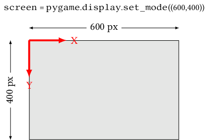
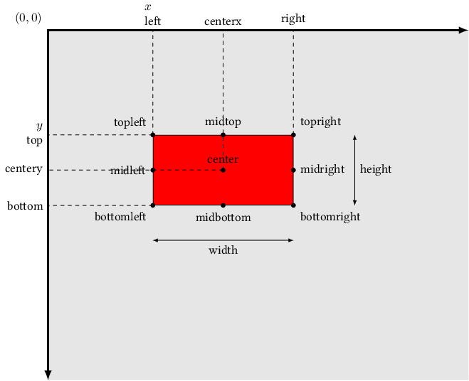

# Chapitre 5. Module Pygame

(testé avec la version 1.9.6)

Ce module ne permet pas de construire tous les types d'interfaces graphiques (notamment les formulaires), mais permet de développer *facilement* des applications 2D dans une fenêtre avec des animations, des sons et des interactions utilisateur via la souris et le clavier de l'ordinateur.

Pour l'installer (dans un environnement virtuel):

```bash
(base)$ python
>>> pip install pygame
```

Quelque soit la complexité de l'interface graphique, le script python utilise la structure suivante:

```python
import pygame

# Définition des constantes
WIDTH, HEIGHT = 600, 400
FPS = 30

# Charger la bibliothèque
pygame.init()

# Définir la taille de la fenêtre en pixels
screen = pygame.display.set_mode((WIDTH, HEIGHT))

# Horloge pour contrôler le fps
clock = pygame.time.Clock()

# Boucle principale
continuer = True
while continuer:
  # Gestion des évènements
  # (comme la fermeture de la fenêtre)
  for e in pygame.event.get():
    if e.type == pygame.QUIT:
      continuer = False

  ##############################
  # Mises à jour des propriétés
  # du contenu


  #########################
  # Dessin du contenu


  #########################  
  # raffraichir l'affichage
  pygame.display.flip()

  # fps: ici 30 image par seconde
  clock.tick(FPS)

# Terminer l'application
pygame.quit()
quit()
```

## 5.1. Session

Pour charger la bibliothèque:

```python
pygame.init()
```

Pour libérer les ressources:

```python
pygame.quit()
```

> Rappel: instruction pour terminer l'application
> 
> ```python
> quit()
> ```

## 5.2. Fenêtre (écran)

Définir:

- la taille:

```python
WIDTH, HEIGHT = 800, 500
screen = pygame.display.set_mode( (WIDTH, HEIGHT) )
```

- le titre:

```python
pygame.display.set_caption("Mon titre")
```

- l'arrière-plan de couleur unie:

```python
screen.fill( (0,0,0) ) # noir
```

- l'arrière-plan depuis une image:

```python
background = pygame.image.load('bg.jpg').convert()
screen.blit(background, (0,0))
```

Une fois le contenu de l'écran défini, on met à jour l'affichage avec la commande:

```python
pygame.display.flip()
```

> Il est aussi possible d'utiliser:
> 
> ```python
> pygame.display.update()
> ```
> 
> Cette variante permet un rafraîchissement plus rapide, notamment si on spécifie, en argument, la portion de l'écran à rafraîchir.

Les coordonnées des éléments graphiques de la fenêtre pygame sont définies dans un repère dont les propriétés sont les suivantes:

- origine: coin supérieur gauche de la fenêtre

- axe des abscisses: dirigé vers la droite.

- axe des ordonnées: dirigé vers le bas.



## 5.3. Événements

Toutes les interactions avec l'interface graphique (appui sur une touche du clavier, clic de la souris...) s'appellent des événements. 

Le module `pygame`  mémorise l'ensemble des événements qui surviennent dans une liste qui est réinitialisée après chaque consultation (une fois par itération de la boucle principale).

- pour accéder à la liste:

```python
liste = pygame.event.get()
```

- pour parcourir la liste (et gérer les événements):

```python
for event in pygame.even.get():
  # gestion spécifique en fonction du type d'événement
```

> Remarque: chaque événement possède un *type* particulier. Pour le connaitre:
> 
> ```python
> type_evenement = event.type
> ```
> 
> Par exemple, pour gérer le clic de fermeture de la fenêtre:
> 
> ```python
> event.type == pygame.QUIT
> ```

Pour une meilleure lisibilité du code, il est préférable de ne pas modifier le contenu de la fenêtre dans la boucle de parcourt des événements. La solution consiste à définir une variable booléenne, consultée ensuite dans la partie *mise à jour du contenu*.

### 5.3.1. Le clavier

Il existe 2 types d'événements:

- `pygame.KEYDOWN` lorsque l'utilisateur appui sur une touche.

- `pygame.KEYUP` lorsque l'utilisateur relâche une touche.

Après vérification du type, on identifie la touche (`event.key`) de la manière suivante (la liste complète des touches est donnée sur [cette page](https://www.pygame.org/docs/ref/key.html)):

```python
if event.type == pygame.KEYDOWN:
  if event.key == pygame.K_UP: # flêche vers le haut
    ...
  elif event.key == pygame.K_a: # lettre a
    ...
```

> Remarque: sous Windows, `event.key` retourne le code de touche d'un clavier **QWERTY**. Pour gérer les caractères d'autres claviers, il est préférable d'utiliser `event.unicode` qui contient une chaîne de caractères:
> 
> ```python
>   if event.unicode == 'a':
>     ...
> ```
> 
>  Pour les caractères non affichages, on peut tester la valeur de `event.scancode`.

> Remarque: il est possible d'obtenir directement l'ensemble des touches pressées (dans un *dictionnaire*) à l'aide de l'instruction suivante:
> 
> ```python
> touches = pygame.key.get_pressed()
> if touches[pygame.K_UP]: # flêche vers le haut pressée ?
>   ...
> ```

### 5.3.2. La souris

Il existe plusieurs types d'événements:

- `pygame.MOUSEMOTION`: lorsque la souris est déplacée.

- `pygame.MOUSEBUTTONDOWN`: lorsque l'utilisateur appuie sur l'un des boutons.

- `pygame.MOUSEBUTTONUP`: lorsque l'utilisateur relâche un bouton.

Une fois vérifié, on peut connaître l'index du bouton qui a été sollicité avec `event.button`:

```python
if event.type==pygame.MOUSEBUTTONDOWN:
  if event.button==1: # bouton gauche
    ...
  elif event.button==2: # bouton du milieu
    ...
  elif event.button==3: # bouton droit
    ...
```

> Remarque: il est possible d'obtenir directement l'ensemble des boutons pressés sous la forme d'un 3-uplet (*bouton1*, *bouton2*, *bouton3*) à l'aide de l'instruction:
> 
> ```python
> boutons = pygame.mouse.get_pressed()
> ```

Les coordonnées de la souris au moment de l'événement s'obtiennent avec `event.pos`:

```python
position = event.pos # 2-uplet (x,y)
```

### 5.3.3. Timer

Il s'agit d'un événement personnalisé se répétant périodiquement:

- pour le configurer:

```python
pygame.timer.set_timer(pygame.locals.USEREVENT+1, 500) # toutes les 500ms
```

- pour le gérer:

```python
if event.type==pygame.locals.USEREVENT+1:
  # action à effectuer
```

## 5.4. Le temps

Pour cadencer la boucle principale:

- avant la boucle:

```python
horloge = pygame.time.Clock()
```

- à chaque itération de la boucle:

```python
horloge.tick(30) # en fps, une seule fois par itération
```

Pour chronométrer (en *ms*):

```python
ms = horloge.get_time()
```

Pour attendre (bloquer le *thread*) pendant une certaine durée:

```python
pygame.time.sleep(2) # en secondes
pygame.time.delay(100) # en ms
```

## 5.5. Formes géométriques

Instructions de dessin utiles:

- un rectangle (*x,y*: coin supérieur gauche du rectangle):

```python
ma_couleur = (255, 0, 0) # R,V,B
x,y,w,h = 10,10,100,200

pygame.draw.rect(screen, ma_couleur, (x,y,w,h), 0) # rectangle plein
pygame.draw.rect(screen, ma_couleur, (x,y,w,h), 1) # contour de taille 1
pygame.draw.rect(screen, ma_couleur, (x,y,w,h), 2) # contour de taille 2
```

- un cercle (*x,y*: coordonnées du centre):

```python
radius = 10 # en pixels

pygame.draw.circle(screen, ma_couleur, (x,y), radius, 0) # cercle plein
pygame.draw.circle(screen, ma_couleur, (x,y), radius, 1) # contour 1
```

- des segments de droites: [`pygame.draw.lines`](https://www.pygame.org/docs/ref/draw.html#pygame.draw.lines).

## 5.6. Surface

Cette classe peut correspondre à différents types d'images:

- le contenu de l'écran (variable `screen`)

- chargées depuis un fichier (ou URL)

- dessinées à l'aide d'instructions python, 

- résultat de rendu d'un texte

Pour récupérer les dimensions d'une *Surface* appelée `image`:

```python
largeur = image.get_width()
hauteur = image.get_height()
```

### 5.6.1. Charger une image

Il faut utiliser `pygame.image.load()` pour spécifier le fichier source et appeler la méthode `convert()` pour optimiser l'espace couleur d'affichage.

Exemple (à placer dans la partie initialisation du programme, avant la boucle principale):

```python
# Formats JPEG et PNG (utiliser convert_alpha() pour transparence)
background = pygame.image.load('bg.jpg').convert()
mon_image = pygame.image.load('monfichier.jpg').convert()
mon_personnage = pygame.image.load('personnage.png').convert_alpha()

# Pour redimensionner la deuxième image en 64x64
mon_image = pygame.transform.scale(mon_image, (64, 64))
```

### 5.6.3. Créer une image

Il faut créer une nouvelle *Surface* vide et la remplir à l'aide des mêmes instructions de dessin (formes, géométriques, images, texte) que celles vues pour l'écran de l'application.

Exemple:

```python
# Nouvelle Surface
s = pygame.Surface( (800,600) )

# Dessiner
...
pygame.draw.rect(s, ma_couleur, (x,y,w,h), 0) # un rectangle
...
```

### 5.6.4. Rendu d'un texte

Pour obtenir l'image d'un texte, il faut:

1. Sélectionner une police: il est dorénavant préférable d'utiliser le module `pygame.freetype` (au lieu de l'ancien `pygame.font`):
   
   ```python
   import pygame.freetype # juste après import.pygame
   
   # nom, taille, gras, italique
   police = pygame.freetype.SysFont('comicsans', 30, True, True)
   ```
   
   Pour obtenir la liste des polices disponibles:
   
   ```python
   liste = pygame.freetype.get_fonts()
   ```
   
   Pour charger une police depuis un fichier:
   
   ```python
   police = pygame.freetype.Font('mapolice.ttf', 20) # taille
   ```

2. Pour générer le rendu graphique (création de la *Surface*):    
   
   ```python
   text, rect = police.render("Mon texte", ma_couleur) # chaîne, couleur
   ```
   
   > Les dimensions du rendu sont fournies dans le *Rectangle* `rect`

### 5.6.5. Afficher une image

Pour *coller* une *Surface* dans une autre (l'écran final `screen`, par exemple), on utilise la méthode `blit`

```python
screen.blit(ma_surface, (x,y)) # x,y: coin supérieur gauche
```

## 5.7. Le son

La gestion s'effectue à l'aide du sous-module `mixer` basé sur la bibliothèque multimédia *SDL*. Il prend en charge les fichiers de type *wav*, *mp3*, *ogg*...

```python
import pygame.mixer
...
# À ajouter juste après l'initialisation de pygame
pygame.mixer.init()
```

> En cas de problèmes de latence, il est possible de modifier les paramètres d'initialisation:
> 
> ```python
> pygame.mixer.pre_init(44100, -16, 2, 512)
> pygame.mixer.init()
> ```

### 5.7.1. Musique (longue) d'arrière-plan

- Pour charger le fichier:

```python
pygame.mixer.music.load('music.mp3')
```

- Pour lancer l'écoute (en boucle):

```python
pygame.mixer.music.play(-1) # indéfiniment
```

* Configuration possible :

```python
pygame.mixer.music.set_volume(0.4) # valeur entre 0 et 1
```

### 5.7.2. Son bref

Il faut créer un objet de type `Sound` et utiliser sa méthode `play()` à l'instant désiré dans l'animation:

- Création de l'objet (avant la boucle principale):

```python
mon_son = pygame.mixel.Sound('son.wav')
```

- Exécution (durant la boucle principale):

```python
mon_son.play()
```

## 5.8. Sprite

Il s'agit d'un élément graphique animé individuellement dans l'interface graphique. À l'origine inventés pour des raisons matérielles, les *Sprites* s'utilisent dorénavant pour structurer le code.

> Attention: il n'est pas souhaitable de définir tous les éléments de l'interface graphique en tant que *Sprite*, notamment l'arrière-plan ou les éléments qui restent fixes (la plupart du temps).

### 5.8.1. Notion de Sprite

Dans Pygame, un *Sprite* est un objet qui possède, au minimum:



- 2 attributs (ou *propriétés*):
  
  - `self.image`: la *Surface* à dessiner (forme géométrique, image...)  
  - `self.rect`: le *Rectangle* indiquant la position et les dimensions (notamment gérer les collisions)

- 2 méthodes:
  
  - `__init(self)__`: pour créer (*construire*) l'objet.
  
  - `update(self)`: pour mettre à jour la position, voire l'image de l'objet

En *POO* (*Programmation Orientée Objet*), un objet se créé depuis une classe (une classe permet de créer plusieurs objets de même nature).

### 5.8.2. Création de la classe

Exemple (à sauvegarder dans un fichier `objet_animes.py`):

```python
import pygame

ROUGE = (255,0,0)

class Balle(pygame.sprite.Sprite):

  def __init__(self, screen_width, screen_height):
    # Initialisation
    pygame.sprite.Sprite.__init__(self)

    # Se souvenir des dimensions de l'écran
    self.sw = screen_width
    self.sh = screen_height

    # Image d'un rectangle rouge
    self.image = pygame.Surface([60, 40])
    self.image.fill(ROUGE)

    # Rectangle pour les collisions
    self.rect = pygame.Rect([0,0,60,40])

  def update(self):
    pass # pas d'instruction pour le moment
```

### 5.8.3. Ajout du Sprite (statique) dans le programme

Même lorsqu'il n'y a qu'un seul *Sprite*, il est préférable de le placer dans *Group* (`pygame.sprite.Group`)

Exemple:

```python
import pygame
from objets_animes import *

...
b = Balle(WIDTH, HEIGHT)
mes_sprites = pygame.sprite.Group()
mes_sprites.add(b)

# Boucle principale
continuer = True
while continuer:
  ...
  mes_sprites.update()

  ...
  mes_sprites.draw(screen)
```

### 5.8.4. Déplacement du Sprite

Dans la classe du Sprite:

- dans la méthode `init()`, on définit 2 nouveaux attributs de déplacement:

```python
self.dx = 3
self.dy = 7
```

- dans la méthode `update()`, on met à jour l'attribut `self.rect`:

```python
# Déplacement
self.rect.x += self.dx
self.rect.y += self.dy

# Gestion des collisions avec le bord
if self.rect.right >= self.sw or self.rect.left <= 0:
  self.dx = -self.dx
if self.rect.bottom >= self.sh or self.rect.top <= 0:
  self.dy = -self.dy
```
